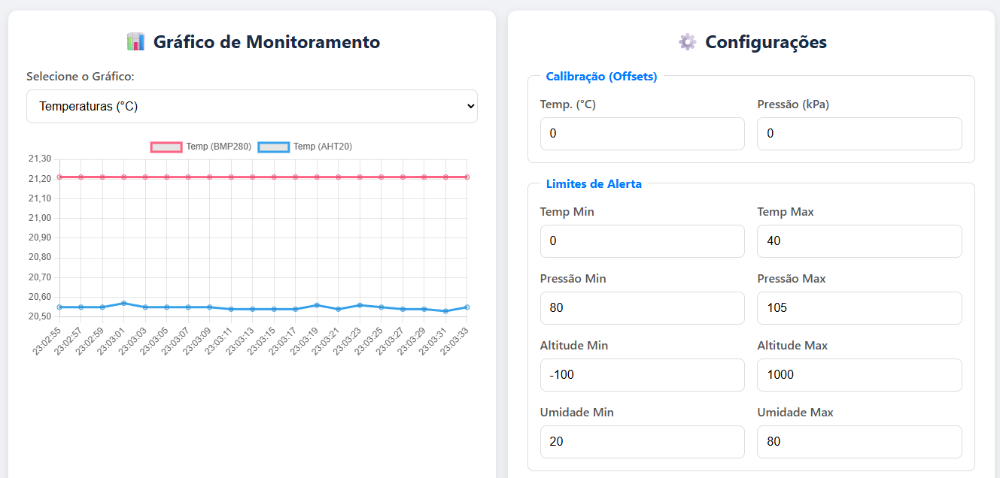

# Monitoramento Ambiental com Raspberry Pi Pico

Um sistema de monitoramento ambiental completo usando o Raspberry Pi Pico, sensores BMP280 e AHT20, com interface web e alertas sonoros/visuais.

## 📋 Recursos Principais

- ✅ Leitura de **temperatura, pressão, altitude e umidade**
- ✅ Interface web responsiva com gráficos em tempo real
- ✅ Alertas visuais (LEDs) e sonoros (buzzer) quando valores saem dos limites
- ✅ Calibração via interface web (offsets e limites personalizáveis)
- ✅ Display OLED integrado para visualização local
- ✅ Conexão Wi-Fi (modo STA)

## 🛠 Hardware Necessário

| Componente              | Descrição                       |
| ----------------------- | ------------------------------- |
| Raspberry Pi Pico       | Microcontrolador principal      |
| BMP280                  | Sensor de pressão e temperatura |
| AHT20                   | Sensor de umidade e temperatura |
| Display OLED SSD1306    | Display I2C 128x64 pixels       |
| Buzzer ativo            | Alarme sonoro                   |
| LEDs (verde e vermelho) | Indicadores visuais             |
| Botão reset             | Resetar configurações           |


## 🔌 Diagrama de Conexões

```plain
Pico GPIO   → Componente
-----------------------------
GP0 (SDA)   → BMP280 + AHT20
GP1 (SCL)   → BMP280 + AHT20
GP5         → Resetar valores
GP14 (SDA)  → OLED Display
GP15 (SCL)  → OLED Display
GP11        → LED Verde
GP13        → LED Vermelho
GP21        → Buzzer
```

## 🚀 Como Usar

1. **Configuração Inicial**

   ```bash
   git clone https://github.com/Leo-Luz-code/Monitoramento-Avancado.git
   cd Monitoramento-Avancado
   ```

2. **Compilação (necessário Pico SDK)**

   ```bash
   mkdir build
   cd build
   cmake ..
   make
   ```

3. **Upload para o Pico**

   - Mantenha pressionado o botão BOOTSEL enquanto conecta o USB
   - Copie o arquivo `.uf2` gerado para a unidade aparecida

4. **Acesso à Interface Web**
   - Conecte-se à rede Wi-Fi configurada no código
   - Acesse o IP do Pico no navegador (ex: `http://192.168.1.100`)

## ⚙ Configurações Personalizáveis

Edite no código ou pela interface web:

```c
// Variáveis para armazenar os dados dos sensores (já com offset)
float temperature_bmp = 0.0f, pressure_kpa = 0.0f, altitude_m = 0.0f;
float temperature_aht = 0.0f, humidity_rh = 0.0f;

// Variáveis para as configurações (limites e offsets)
float temp_offset = 0.0f, pressure_offset_kpa = 0.0f;
float temp_min = 0.0f, temp_max = 40.0f;
float pressure_min = 80.0f, pressure_max = 105.0f;
float altitude_min = -100.0f, altitude_max = 1000.0f;
float humidity_min = 20.0f, humidity_max = 90.0f;
```

## 🌐 Interface Web

 <!-- Adicione screenshot real -->

- Gráficos em tempo real de todos os parâmetros
- Configuração dos limites de alerta
- Ajuste fino de calibração (offsets)
- Visualização dos valores atuais com destaque para medidas fora do normal

## 📊 Protocolo de Comunicação

| Endpoint        | Método | Descrição                             |
| --------------- | ------ | ------------------------------------- |
| `/`             | GET    | Página web principal                  |
| `/sensordata`   | GET    | Retorna dados em JSON                 |
| `/set_settings` | GET    | Ajusta configurações via query params |

## 📝 Licença

MIT License - Livre para uso e modificação

## 🤝 Como Contribuir

1. Faça um fork do projeto
2. Crie sua branch (`git checkout -b feature/AmazingFeature`)
3. Commit suas mudanças (`git commit -m 'Add some AmazingFeature'`)
4. Push para a branch (`git push origin feature/AmazingFeature`)
5. Abra um Pull Request

---

Desenvolvido com ❤️ por Leonardo Rodrigues Luz
